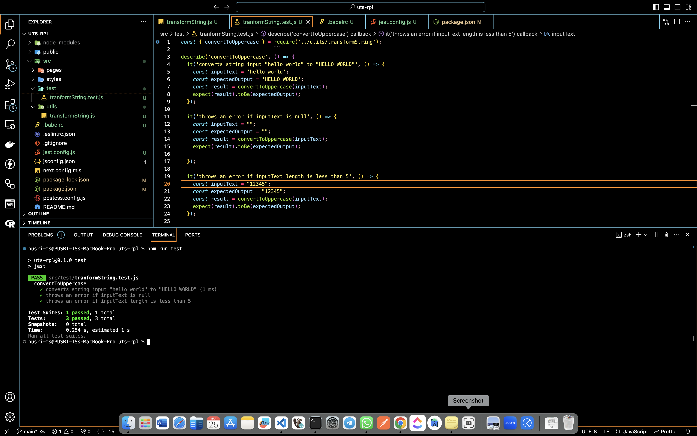
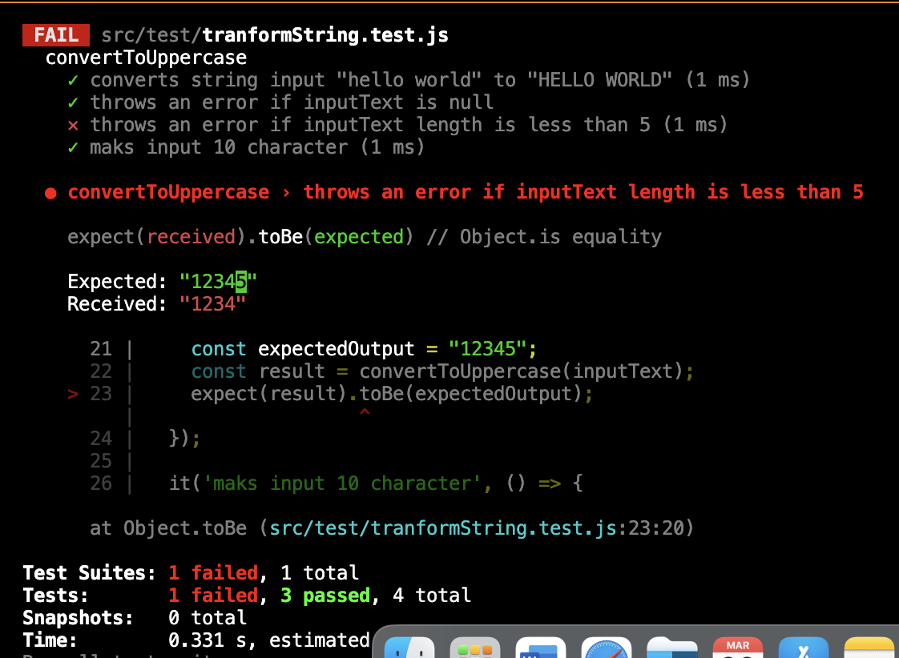

Kelompok 4 MIK UTS Rekayasa Perangkat Lunak Lanjut.

## Getting Started

First, run :

```bash
npm run test
```

## Nama Kelompok

```bash
1. Toni Ismail
2. M. Hafiz Budi Prayoga
3. Hafiz Sytar
4. Dika kurnia Nanda
5. M. Hidayat Mauluddin
```

## Scenario
```bash
Fungsi untuk transform value, dari huruf kecil ke huruf besar, 
input yang diterima merupakan data type string.
```

```bash
input
min lenght 5
maks 10
tidak boleh kosong
```

```bash
Feature: Uppercase String Transformation

Convert string input to uppercase
	Given a string input "hello world"
	When the string is transformed to uppercase
	Then the result should be "HELLO WORLD"

 Handling empty input
	Given an empty string input
	When the string is transformed to uppercase
	Then the result should be an empty string

Handling short input length
	Given a string input with length less than 5
	When the string is transformed to uppercase
	Then the result should be the same as the input string

 Handling input length of 10 characters
	Given a string input with length of 10 characters
	When the string is transformed to uppercase
	Then the result should be the same as the input string

```

### Hasil success all test


### Hasil failed di length character


## Link video presentasi
```bash
https://drive.google.com/file/d/1n2DtiLGgFwqiyYx-X_377nNrNgcFUeYR/view?usp=sharing
```
